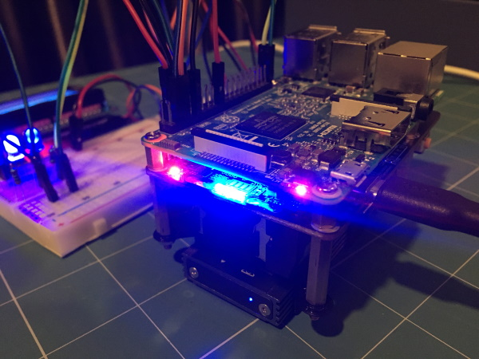
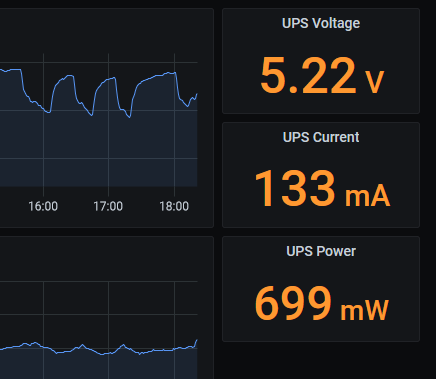

# 52pi / GeeekPi UPS Prometheus Exporter

## Introduction

[52pi](https://wiki.52pi.com/) offer a range of boards that can be loaded with two 18650 cells to provide battery-backed UPS functionality for your Raspberry Pi:

- [EP-0114](https://wiki.52pi.com/index.php/UPS_for_Raspberry_Pi_4B/3B%2B/3B_SKU:_EP-0114)
- [EP-0118](https://wiki.52pi.com/index.php/UPS_(With_RTC_%26_Coulometer)_For_Raspberry_Pi_SKU:_EP-0118)
- [EP-0136](https://wiki.52pi.com/index.php/UPS_Plus_SKU:_EP-0136) - UPS Plus

Here we see a EP-0118 board providing uninterrupted power to a Raspberry Pi based weather station:



These boards are also commonly sold on AliExpress and other similar sites under the GeeekPi brand.

The EP-0114 and EP-0118 support reading energy consumption metrics (voltage, current and power) via I2C.  The UPS Plus (EP-0136) provides much more telemetry, including battery charging status.

The 52pi wiki pages provide sample Python scripts for reading power consumption and other metrics (depending on the model) from the board via I2C.  This project adapts those sample scripts and uses [Rico Berger's script_exporter](https://github.com/ricoberger/script_exporter) package to create a Prometheus exporter for the 52pi UPS board power metrics.

Note 52pi have the following boards that do not support reading power metrics via I2C:

- [EP-0100](https://wiki.52pi.com/index.php/UPS_for_Raspberry_Pi_3B/3B%2B_SKU:_EP-0100)

So far this project has ben tested with the EP-0118.  It may or may not currently work with the EP-0114 and EP-0136 boards.

## License

This work is offered under the terms of the MIT license.  See the [LICENSE](LICENSE) file for details.

## Build script_exporter Base Image

This piups_exporter project is built on [Rico Berger's script_exporter](https://github.com/ricoberger/script_exporter) project.  There is an [image for script_exporter](https://hub.docker.com/r/ricoberger/script_exporter) on Docker Hub but it only supports amd64 architecture so we need to rebuild it for armv7 so we can use it on our Raspberry Pi.

Fortunately Rico has included the Dockerfile in his project, so assuming you already have Docker on your Pi, it's very easy to build the armv7 Docker image for script_exporter as follows:

```bash
git clone https://github.com/ricoberger/script_exporter.git
cd script_exporter
sudo docker build -t ricoberger/script_exporter:latest .
```

Depending on how you manage images, you may want to tag this differently and you may want to push it to a private repository, but these steps are optional.

## Build piups_exporter Image

Now that you have the script_exporter image built on your Raspberry Pi, we can build the piups_exporter as follows:

```bash
git clone https://github.com/brendonmatheson/piups_exporter.git
cd piups_exporter
./build.sh
```

## Test piups_exporter

Run the exporter in interactive mode using the supplied convenience script:

```bash
./run.sh
```

In a different shell window or from another host, `curl` the UPS metrics:

```bash
curl http://localhost:9469/probe?script=piups

# HELP script_success Script exit status (0 = error, 1 = success).
# TYPE script_success gauge
script_success{script="piups"} 1
# HELP script_duration_seconds Script execution time, in seconds.
# TYPE script_duration_seconds gauge
script_duration_seconds{script="piups"} 0.280330
# HELP piups_bus_voltage_volts The voltage supplied to the connected device(s)
# TYPE piups_bus_voltage_volts gauge
piups_bus_voltage_volts 5.208
# HELP piups_bus_current_milliamps The current drawn by the connected device(s)
# TYPE piups_bus_current_milliamps gauge
piups_bus_current_milliamps 136.805
# HELP piups_power_milliwatts The power consumed by the connected devices in milli-watts
# TYPE piups_power_milliwatts gauge
piups_power_milliwatts 737.561
# HELP piups_shunt_voltage_millivolts TBD
# TYPE piups_shunt_voltage_millivolts gauge
piups_shunt_voltage_millivolts 7.080
```

Note that the script_exporter exposes script-derived metrics using the `/probe` endpoint and publishes it's own gostats on `/metrics`.  See the script_exporter documentation for further elaboration on how this works.

## Production Deployment on Docker Compose

`piups_exporter` can be run in Docker Compose using the supplied `docker-compose.yaml`:

```yaml
version: "3"
services:

  piups_exporter:
    devices:
      - "/dev/i2c-1:/dev/i2c-1"
    image: "brendonmatheson/piups_exporter:latest"
    ports:
      - "9469:9469"
    restart: "always"
```

Importantly we need to map the i2c bus into the container so that it is available to the Python script that will be pulling metrics from the board.

Then you can launch the service with the supplied convenience script:

```bash
./start.sh
```

which actually just does:

```bash
sudo docker-compose up
```

To stop the service use the supplied convenience script:

```bash
./stop.sh
```

which actually just does:

```bash
sudo docker-compose down
```

## Prometheus Scrape Job

Now add a job to your Prometheus server's config.  The only thing you have to change is the target:

```yaml
  - job_name: "piups"
    metrics_path: "/probe"
    params:
      script: ["piups"]
    static_configs:
      - targets:
          - "10.80.3.31:9469"
    scrape_interval: 10s
```

Now you will be able to visualize the energy consumption metrics from your Raspberry Pi in Grafana or elsewhere:



